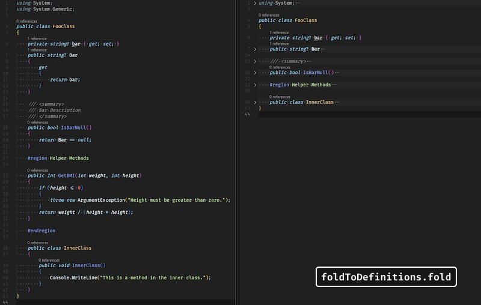

# Fold to Definition

Fold to Definition is a VS Code extension that enhances code readability by folding to show only code definitions. With a single command or keyboard shortcut, you can quickly collapse comments, imports, regions etc. Leaving only the structure of your code visible.

## Features

- Fold all comments, imports, and regions with one command.
- Optionally fold classes, interfaces, and local functions.
- Customizable folding behavior via extension settings.
- Keyboard shortcut: <kbd>Ctrl+M Ctrl+O</kbd> (Windows/Linux) or <kbd>Cmd+M Cmd+O</kbd> (macOS).

## Requirements

No additional requirements. Works out of the box with Visual Studio Code 1.101.0 or later.

## Extension Settings

This extension contributes the following settings:

- `foldToDefinitions.foldComment`: Fold comments when folding to definitions (default: `true`)
- `foldToDefinitions.foldImport`: Fold imports when folding to definitions (default: `true`)
- `foldToDefinitions.foldRegion`: Fold `#region` blocks when folding to definitions (default: `true`)
- `foldToDefinitions.foldClassAndInterface`: Choose how to fold classes and interfaces: `None` (do not fold), `Inner class` (fold only inner classes/interfaces), or `All` (fold all classes/interfaces). (default: `None`)
- `foldToDefinitions.foldLocalFunction`: Fold local functions (default: `false`)
- `foldToDefinitions.foldOnFileOpen`: Automatically fold to definitions when a file is opened (default: `false`)

## Usage

1. Open a file in the editor.
2. Run the command **Fold to definitions** from the Command Palette (`Ctrl+Shift+P`).
3. Or use the keyboard shortcut: <kbd>Ctrl+M Ctrl+O</kbd> (Windows/Linux) or <kbd>Cmd+M Cmd+O</kbd> (macOS).

## Known Issues

- Folding behavior may vary depending on language support and document symbol providers.
- Some languages may not support all folding kinds.

## Release Notes

### 0.0.4 (2025-08-12)

- [Changed] Turn off folding for nested property.

### 0.0.3 (2025-08-11)

- [Fixed] Resolved an issue where symbols were not folded at the correct lines.

### 0.0.2 (2025-08-10)

- [Added] Automatically folds code to definitions when a file is opened.
- [Added] Setting to control automatic folding on file is open behavior.

### 0.0.1 (2025-08-10)

- Initial release: fold comments, imports, regions, and optionally classes/interfaces and local functions.